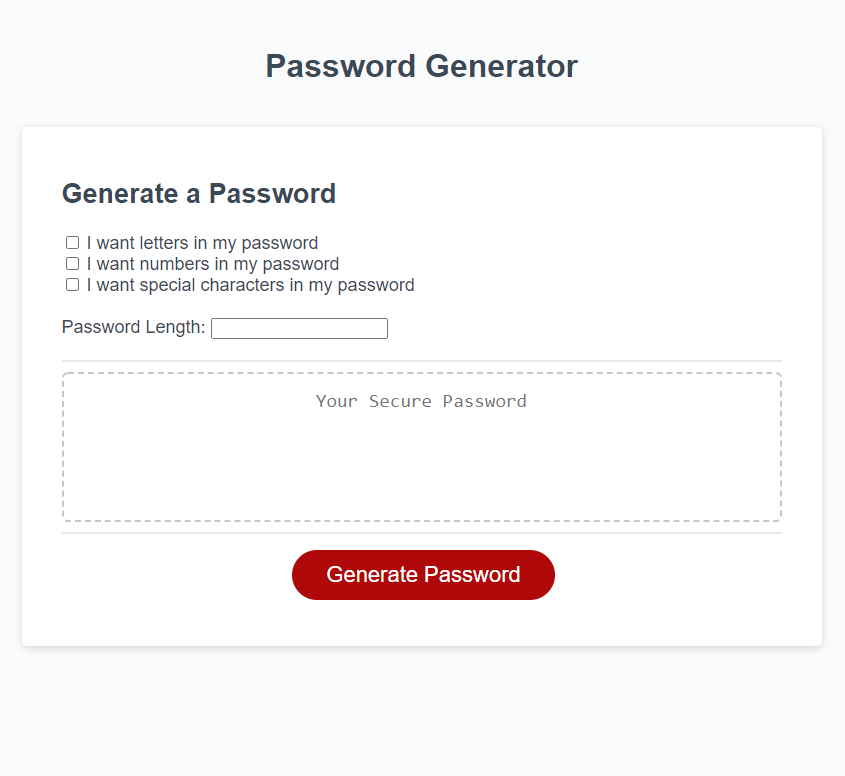

# Password Generator  

## Description

For this project I used Javascript to create a function that generates a random password based on the users inputs. 

This website features:

1. Check boxes that, when selected, make the passwords more complex.
2. Randomly capitalizes or lowercases letters when the letters box is checked.
3. Each type of character has an equal chance of being selected when its box is checked. For example, if all three boxes are checked and the password length is only one, each type of character has an equal shot at being that one character.
4. Error messages when a non-integer is inputed in the password length box.

## Installation

To view this website open up the index.html doc using your favorite web browser.

[Click here to access the homepage](https://pfvatterott.github.io/PasswordGenerator/)

## Screenshot of Main Page

## Contributing

Please feel free to offer any recommendations and to contribute yourself by forking the repository. 

## License

MIT License

Copyright (c) 2020 Paul Vatterott

Permission is hereby granted, free of charge, to any person obtaining a copy
of this software and associated documentation files (the "Software"), to deal
in the Software without restriction, including without limitation the rights
to use, copy, modify, merge, publish, distribute, sublicense, and/or sell
copies of the Software, and to permit persons to whom the Software is
furnished to do so, subject to the following conditions:

The above copyright notice and this permission notice shall be included in all
copies or substantial portions of the Software.

THE SOFTWARE IS PROVIDED "AS IS", WITHOUT WARRANTY OF ANY KIND, EXPRESS OR
IMPLIED, INCLUDING BUT NOT LIMITED TO THE WARRANTIES OF MERCHANTABILITY,
FITNESS FOR A PARTICULAR PURPOSE AND NONINFRINGEMENT. IN NO EVENT SHALL THE
AUTHORS OR COPYRIGHT HOLDERS BE LIABLE FOR ANY CLAIM, DAMAGES OR OTHER
LIABILITY, WHETHER IN AN ACTION OF CONTRACT, TORT OR OTHERWISE, ARISING FROM,
OUT OF OR IN CONNECTION WITH THE SOFTWARE OR THE USE OR OTHER DEALINGS IN THE
SOFTWARE.
